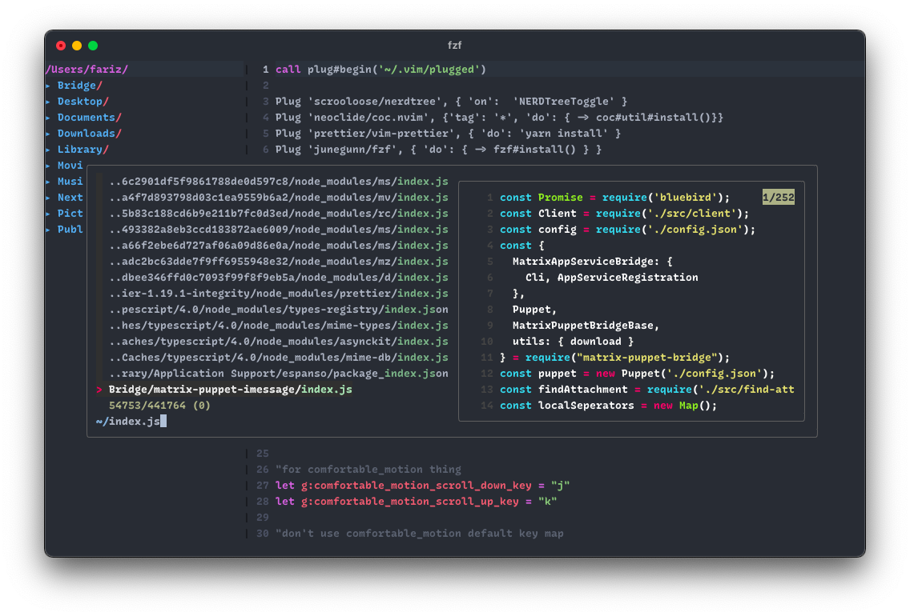

# faultable's dotfiles

mom, look I'm sharing my dotfiles!

Untuk selengkapnya bisa baca di [blog](https://faultable.dev/faultable-setup-2021/)

## What's in the box?

- vim (primary code editor, cocok untuk yang benci vscode)
- git (primary version control system, cocok untuk yang anti rsync)
- tmux (terminal multiplixer, cocok untuk orang sibuk)
- iTerm2 (terminal emulator, because terminal.app is shit)
- Alacritty (terminal emulator, cocok untuk yang pakai GNU/Linux di lingkungan desktop)

## vim(1)

vim adalah penyunting kode utama gue, karena kebanyakan gue aktivitas ngoding gue berada
di remote server. Sebelumnya pakai neovim dan entah mengapa merasa *sedikit* berat dan
juga tidak ada perubahan yang kontras antara keduanya, lalu *stick* di vim murni and never
look back

Pernah beberapa pekan menghabiskan waktu untuk mempelajari emacs dengan tujuan ingin pindah
dari dunia per-wq-an, dan ternyata kurang cocok dengan kombinasi shortcut sebagai *command*.

Oh iya, ukuran emacs di gue sampai ~100M, spacemacs included. Kalau tertarik pindah ke emacs,
gue menyarankan pakai [Spacemacs](https://www.spacemacs.org) karena asik, ergonomis, dan terlihat
keren untuk sebuah sitem operasi emacs.

Anyway, konfigurasi vim gue menggunakan tema [One Dark](https://github.com/joshdick/onedark.vim) dan
beberapa plugin yang bisa dilihat sendiri di berkas [.vimrc](./vimrc). Untuk menggunakan konfigurasi
gue, sesederhana mengunduh [vim-plug](https://github.com/junegunn/vim-plug) lalu jalankan `:PlugInstall`. Sepertinya ada beberapa dependensi eksternal, tapi gue lupa apa aja.

## git(1)

Tidak ada alasan lain mengapa pakai git karena tuntutan pasar. Alternatif dari git yang menurut gue
menarik adalah [fossil](https://fossil-scm.org/home/doc/trunk/www/index.wiki) atau gak [radicle](https://radicle.xyz) alias git untuk yang edgy.

Walau gue selalu berjuang untuk mengingat perintah apa saja yang ada dan layak digunakan di git, tapi
gue selalu menolak untuk menggunakan versi GUI dari git client. Tidak ada yang spesial dari konfigurasi git gue, tapi yang layak di *highlight* antara lain:

- commit gue [selalu signed](https://git-scm.com/book/en/v2/Git-Tools-Signing-Your-Work)
- setiap project gue menggunakan identitas yang berbeda
- git diff gue lucu!

Khusus untuk git diff, berikut gambarannya:

Yang versi atas adalah yang gue gunakan yang mana pakai [delta](https://github.com/dandavison/delta) dan yang versi bawah adalah bawaan dari git. Menggunakan delta daripada bawaan ataupun [diff-so-fancy](https://github.com/so-fancy/diff-so-fancy) membuat perubahan terlihat lebih intuitif dan nyaman dipandang. 

## tmux(1)

Alasan utama gue pakai terminal multiplexer (tmux/screen) bukan karena gue sibuk, tapi karena ehm biar dapet scrollback karena gue pakai [mosh](https://mosh.org)! Alesan pakai mosh ada di blog, intinya, dengan menggunakan tmux gue bisa scroll lagi untuk melihat-lihat output yang panjang khususnya log.

Selain itu, tmux juga berguna (sangat berguna) untuk menyimpan session. Workflow gue dalam bekerja dengan remote server adalah mosh@some-host -- tmux a, yang mana ketika sesi mosh berhasil dibuat, gue akan kembali ke aktivitas terakhir.

Untuk tangkapan layar tmux gue sudah diwakilkan di bagian git, tidak ada yang spesial dengan konfigurasi tmux gue, tapi tampilan tmux gue lebih clean. Ya, kan?

## iTerm2

Komputer utama gue adalah Macbook Air 2015 kentang dengan RAM 8GB. Gue pernah berusaha keras untuk mencintai Terminal.app namun tidak pernah berhasil. Alasan menggunakan iTerm2 karena ini terminal emulator pertama yang gue gunakan (Terminal.app gak gue hitung) ketika pertama kali menggunakan MacOS.

Selain menggunakan iTerm2, gue pernah juga menggunakan Alacritty, Kitty, dan Hyper dan selalu kembali lagi ke iTerm2 meski sebelumnya gue paling lama pakai Kitty. Alasan pindah dari Kitty adalah karena harus *hot close* Kitty untuk menerapkan konfigurasinya dan alasan pindah dari Alacritty adalah karena belum ada dukungan *native tab*, dan ehm, logo Alacritty enggak banget buat gue hahaha.

Perbedaan paling kontras antara Terminal.app dan iTerm2 adalah: Dukungan [true colors](https://gist.github.com/XVilka/8346728), god damn it, Apple. Kekurangan lain dari Terminal.app sebenarnya bisa gue maafkan, tapi untuk masalah warna, sorry not sorry.

Oh iya, iTerm2 juga mendukung GPU Rendering (dan natively via Metal) tapi gue gak peduli-peduli amat karena gak merasakan hal-hal terkait latensi di rendering. Alasan gak pakai [Hyper](https://hyper.is) karena, it's like, ok i'm frontend developer, but seriously? Gue bukan meremehkan atau apapun itu, cuma, seriously???

Konfigurasi iTerm2 gue gak ada keren-kerennya, bahkan terkesan mainstream. Tapi gue pakai *color scheme* One Dark and it's so fuckin cool.

## Alacritty

Cool kid, really great performance, dan ditulis menggunakan Rust. Konfigurasi hot-reloaded, tinggal :w maka konfigurasi terterapkan. Cuma salah satunya gak/belum ada dukungan native tab, dan menggunakan tmux dalam tmux gue rasa sesuatu yang kurang efektif?

Kalau gue harus pakai sistem operasi GNU/Linux, gue akan menggunakan Alacritty daripada terminal emulator favorit gue dulu [Terminator](https://terminator-gtk3.readthedocs.io/en/latest/) karena alasan cross-platform dan sekarang tahun 2021.

Udah lama gak pakai Alacritty jadi gue lupa konfigurasi gue gimana.

## Dan lain-lain

Untuk selengkapnya, bisa dibaca di blog gue [disini](https://faultable.dev/faultable-setup-2021/).

## Lisensi

WTFPL.